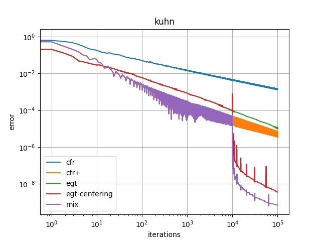
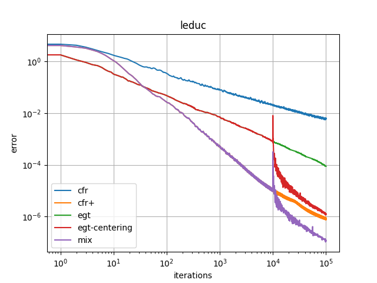
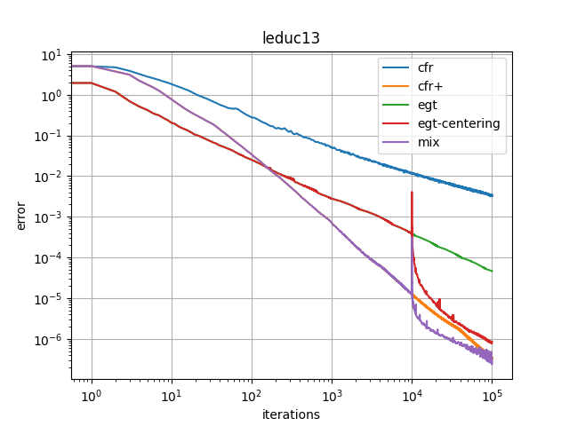

# EGT on EFG

## Benchmark

- the number of iterations: 100'000
- the error is the last one, not the minimum

| Method                  | KuhnPoker             | LeducHold'em(3 ranks) | LeducHold'em(13 ranks) |
| ----------------------- | --------------------- | --------------------- | ---------------------  |
| CFR                     | 0.3[s], error=1.3e-03 | 6.8[s], error=5.6e-03 | 153[s], error=3.2e-03  |
| CFR+                    | 0.3[s], error=3.6e-06 | 7.8[s], error=7.5e-07 | 149[s], error=3.3e-07  |
| EGT                     | 1.3[s], error=1.0e-05 | 32[s],  error=8.7e-05 | 578[s], error=4.6e-05  |
| EGT-centering           | 1.3[s], error=3.6e-09 | 32[s],  error=1.2e-06 | 575[s], error=8.5e-07  |
| mix(CFR+,EGT-centering) | 1.2[s], error=6.3e-10 | 29[s],  error=1.0e-07 | 538[s], error=3.2e-07  |

