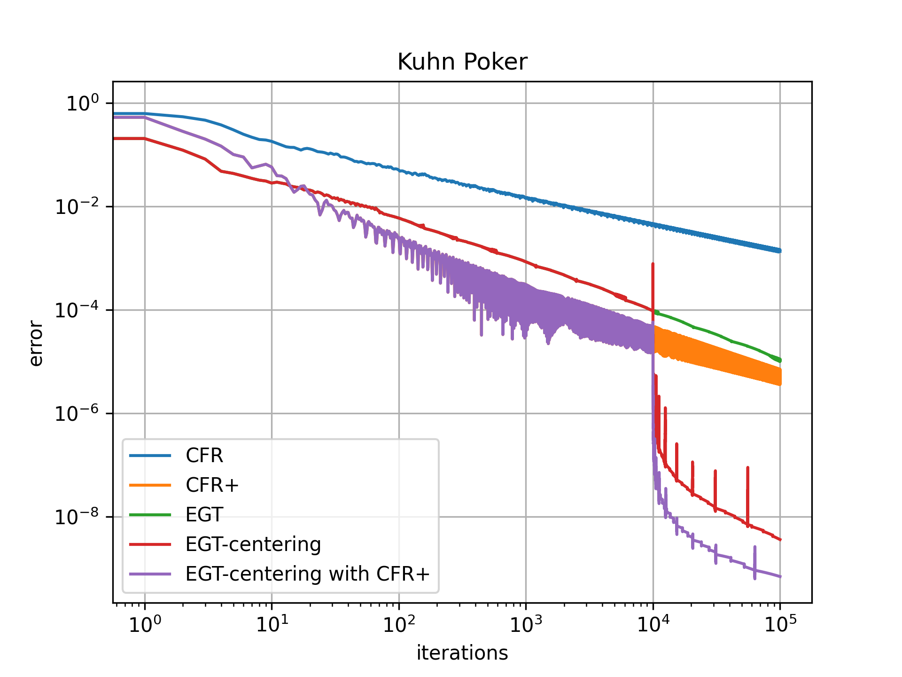

# EGT on EFG

## Benchmark

- the number of iterations: 100'000
- the error is the last one, not the minimum

| Method                  | KuhnPoker              | LeducHold'em(3 ranks) | LeducHold'em(13 ranks) |
| ----------------------- | ---------------------- | --------------------- | ---------------------  |
| CFR                     | 0.11[s], error=1.4e-03 | 1.5[s], error=5.6e-03 | 46[s],  error=3.2e-03  |
| CFR+                    | 0.11[s], error=4.4e-06 | 1.5[s], error=7.6e-07 | 46[s],  error=3.7e-07  |
| EGT                     | 0.30[s], error=1.1e-05 | 5.6[s], error=8.8e-05 | 145[s], error=4.6e-05  |
| EGT-centering           | 0.30[s], error=3.6e-09 | 5.7[s], error=1.2e-06 | 148[s], error=8.5e-07  |
| EGT-centering with CFR+ | 0.28[s], error=7.0e-10 | 5.3[s], error=1.3e-07 | 140[s], error=3.5e-07  |

-error.png)
-error.png)
