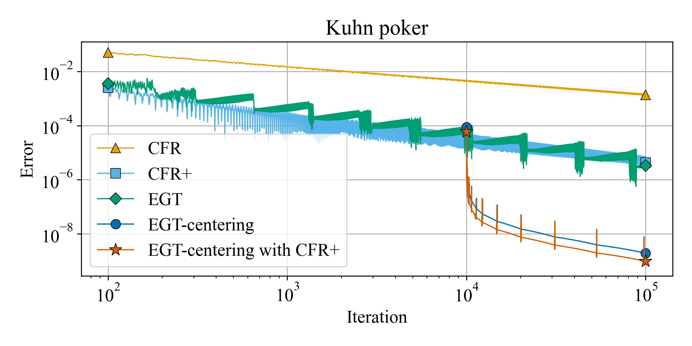
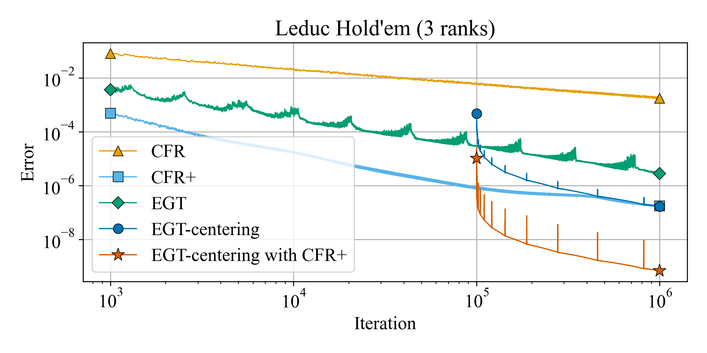
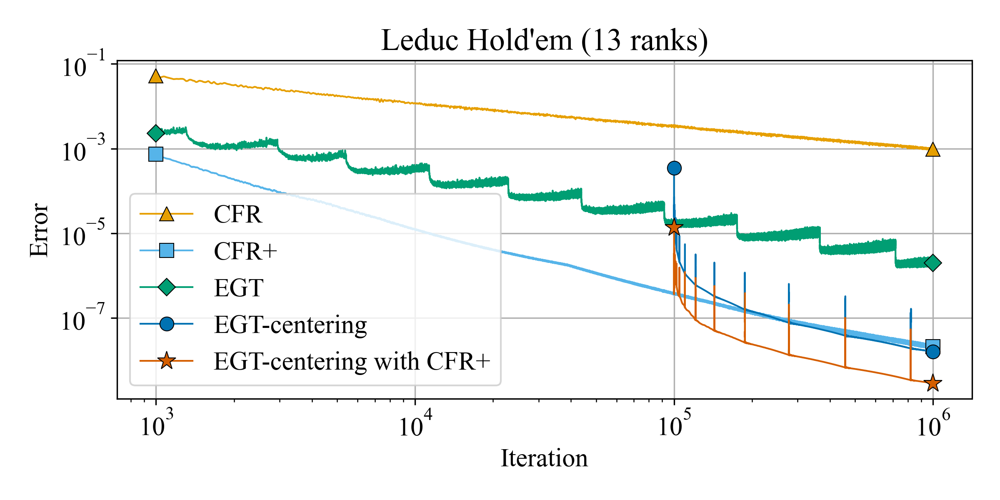

# EGT on EFG

## Benchmark

| Method                  | KuhnPoker              | LeducHold'em(3 ranks) | LeducHold'em(13 ranks) |
| ----------------------- | ---------------------- | --------------------- | ---------------------  |
| CFR                     | 0.12[s], error=1.4e-03 | 15[s], error=1.8e-03 | 470[s],  error=9.6e-04  |
| CFR+                    | 0.12[s], error=4.3e-06 | 15[s], error=1.7e-07 | 466[s],  error=2.1e-08  |
| EGT                     | 0.33[s], error=3.3e-06 | 45[s], error=2.8e-06 | 1151[s], error=2.0e-06  |
| EGT-centering           | 0.28[s], error=1.9e-09 | 45[s], error=1.7e-07 | 1199[s], error=1.6e-08 |
| EGT-centering with CFR+ | 0.24[s], error=9.7e-10 | 42[s], error=7.0e-10 | 1091[s], error=2.8e-09 |

