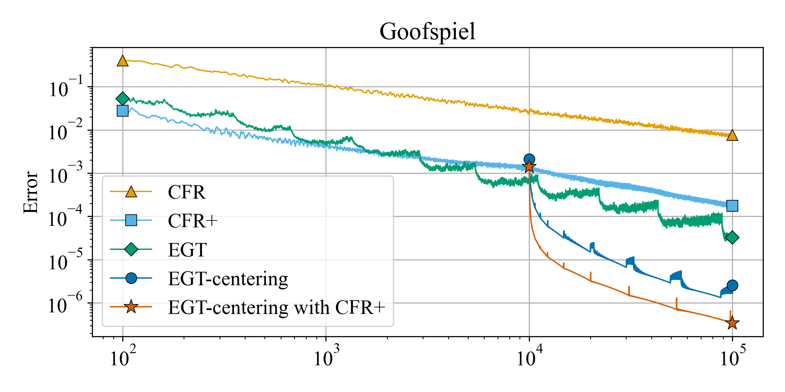

# EGT on EFG

## Benchmark

| Method                  | KuhnPoker        | LeducHold'em(3 ranks) | LeducHold'em(13 ranks) | Goofspiel(4 ranks) |
| ----------------------- | ---------------- | --------------------- | ---------------------- | ------------------ |
| CFR                     | 0.12[s], 1.4e-03 | 14[s], 1.8e-03        | 486[s],  9.6e-04       | 120[s], 7.6e-3     |
| CFR+                    | 0.11[s], 4.3e-06 | 14[s], 1.7e-07        | 476[s],  2.1e-08       | 121[s], 1.8e-4     |
| EGT                     | 0.24[s], 3.3e-06 | 40[s], 2.8e-06        | 1146[s], 2.0e-06       | 319[s], 3.2e-5     |
| EGT-centering           | 0.23[s], 1.9e-09 | 42[s], 1.7e-07        | 1119[s], 1.6e-08       | 321[s], 2.6e-6     |
| EGT-centering with CFR+ | 0.21[s], 9.7e-10 | 43[s], 7.0e-10        | 1048[s], 2.8e-09       | 296[s], 3.4e-7     |

